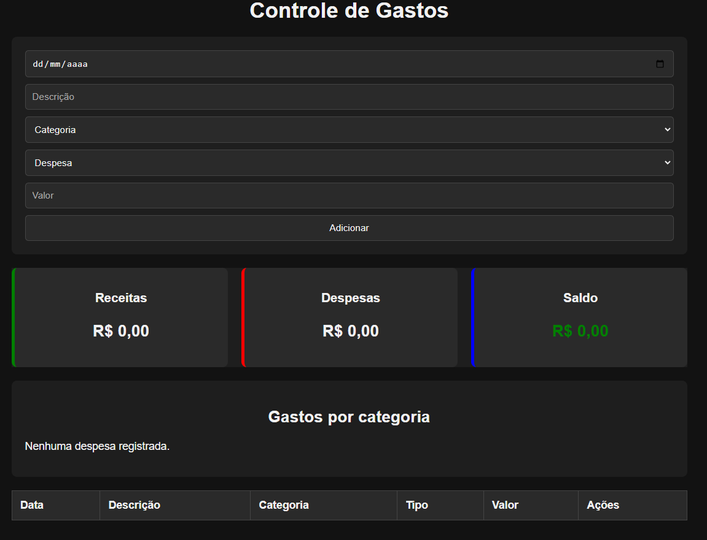
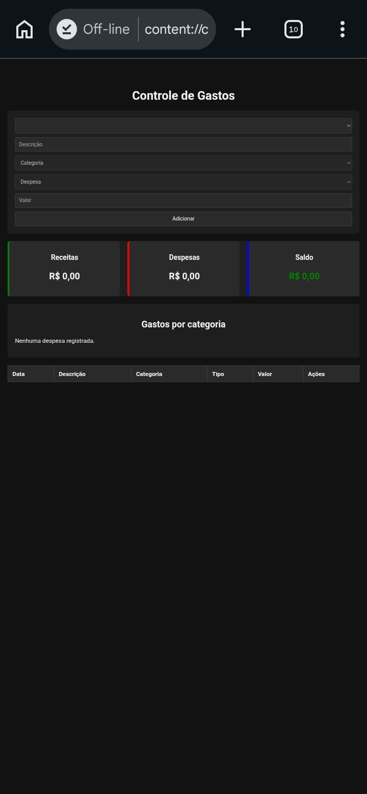

# 💰 Controle de Gastos

Aplicativo web para controle de receitas e despesas pessoais, desenvolvido com HTML, CSS e JavaScript puro.

## 🚀 Acesse o projeto

https://joaopedros111.github.io/controle-gastos/

## 📱 Funcionalidades

* Cadastro de receitas e despesas
* Categorias personalizadas
* Edição de lançamentos
* Exclusão de lançamentos
* Cálculo automático de saldo
* Resumo de receitas e despesas
* Resumo de gastos por categoria
* Armazenamento local (localStorage)
* Layout responsivo para celular
* Aplicativo instalável (PWA)

## 🛠️ Tecnologias utilizadas

* HTML5
* CSS3
* JavaScript (Vanilla JS)
* LocalStorage
* GitHub Pages
* Progressive Web App (PWA)

## 📸 Capturas de tela

Adicione aqui screenshots do aplicativo.

### Tela principal



### Versão mobile



## 💻 Instalação local

Clone o repositório:

```bash
git clone https://github.com/joaopedros111/controle-gastos.git
```

Entre na pasta:

```bash
cd controle-gastos
```

Abra o arquivo:

```text
index.html
```

ou utilize o Live Server do VS Code.

## 📈 Próximas melhorias

* Exportação para Excel
* Backup e restauração de dados
* Sincronização entre dispositivos
* Dashboard mensal
* Relatórios financeiros

## 👨‍💻 Autor

João Pedro Santos

GitHub: https://github.com/joaopedros111
